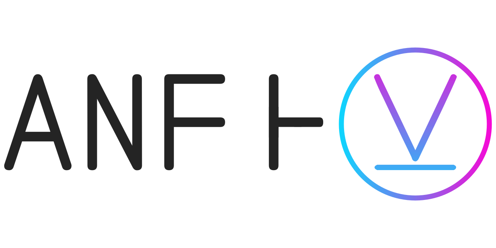

  

# ANF Ͱ ⊻

You can find all documentation related to this project in `docs`
directory and in github pages:

- [Documentation](docs/README.org)
  - [OpenCL intro](docs/opencl/README.org)
    - [Sparse Matrix](docs/opencl/matrix/README.org)
  - [SAT solving](docs/sat/README.org)
  - [Related Tools](docs/tools/README.org)

There is also documentation in source code files that can be checked
with haddock.

## Project structure
